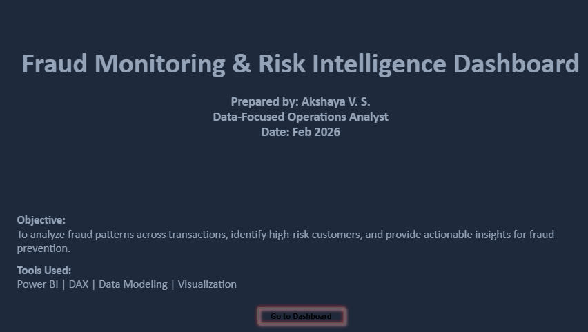
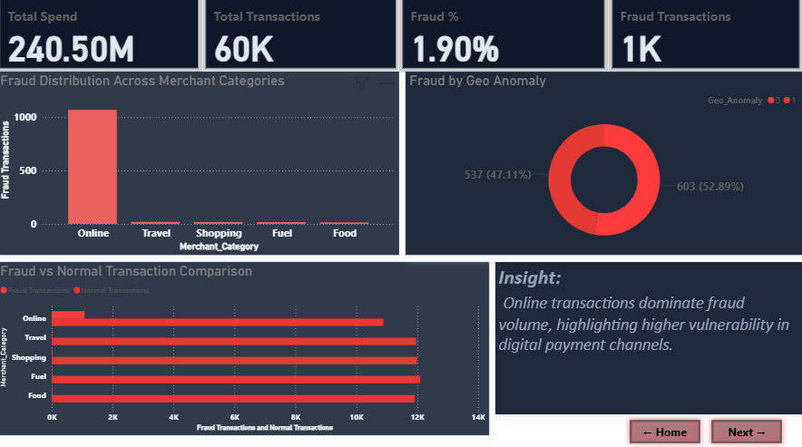
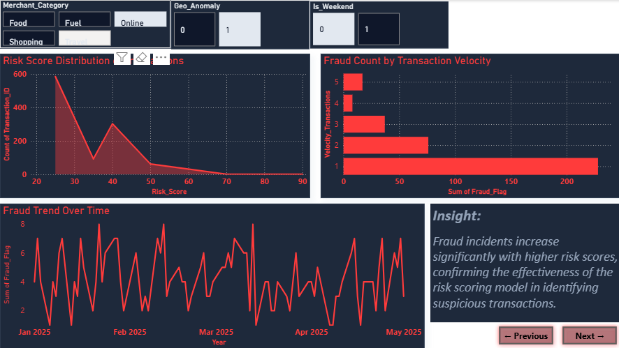
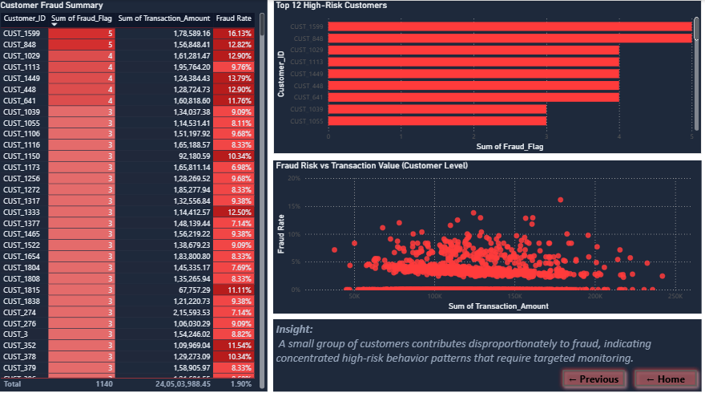

# Fraud Monitoring And Risk Intelligence Dashboard

## Overview
This Power BI dashboard analyzes transaction-level data to identify fraud patterns, high-risk customers, and behavioral anomalies.

## Key Features
- Fraud rate calculation using DAX
- Customer-level fraud analysis
- Risk score validation
- Transaction anomaly detection
- Interactive navigation with buttons

## Tools Used
- Power BI
- DAX
- Data Modeling
- Data Visualization

## Dashboard Preview

### Cover Page

### Page 1 – Fraud Overview

### Page 2 – Risk & Trend Analysis

### Page 3 – Customer Risk Analysis

## Key Insights
- Online transactions show highest fraud concentration
- Fraud increases with higher risk scores
- Small group of customers contributes to majority of fraud
- Transaction velocity plays a critical role in fraud detection

## Business Impact

- Enabled real-time monitoring of fraud metrics and risk trends across transactions  
- Provided clear visibility into high-risk customers and anomaly patterns  
- Improved decision-making speed for risk and operations teams  
- Reduced dependency on manual analysis through interactive dashboard insights  

## Author
Akshaya V.S.
